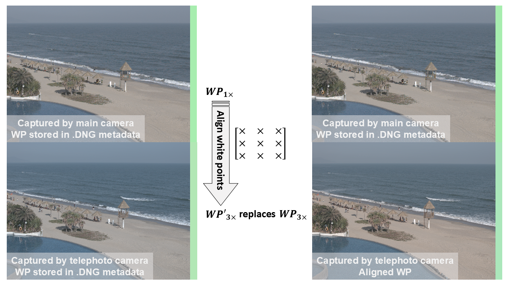

<p align="center">
    <h1 align="center">Color correction for multi-camera systems: aligning white points</h1>
    <p align="center">
        <a href="https://carrybio.netlify.app/about/">Ruikai He</a>
        ·
        <a href="https://scholar.google.com/citations?user=vyrC0lwAAAAJ&hl=en">Minchen Wei</a>
        ·
        <a>Xinchao Qu</a>
        ·
        <a>Tao Hu</a>
    </p>
</p>

<div align="center">

[](https://opg.optica.org/josaa/upcoming_pdf.cfm?id=550307)
[](https://www.semanticscholar.org/paper/A-data-set-for-color-research-Barnard-Martin/58400ccf99214b17c6a9b6d460515293adc88fec)
[](https://ieeexplore.ieee.org/document/6475015)
[](https://github.com/Hurricane-k/Demo-AlignWhitePoints)
[]()

</div>

## 🔖 Abstract

In recent years, many devices (e.g., smartphones and drones) contain multiple cameras, allowing an easy change of
different focal lengths and fields of view (FOVs) when capturing ascene. Obvious color differences are easily observed when
the images are captured by the different cameras for the same scene with different FOVs in asequential order, which
significantly affects the user experience. Most studies and investigations attributedsuch color differences to the different spectral sensitivity functions of the cameras. In this study, we found that the differences could be mainly due
to the inconsistency among the white points estimated from the images captured by the different cameras. Based on
this finding, we propose a method to calibrate the cameras under a set of calibration light sources that are carefully
selected and to use a conversion matrix to align the white points among the images in real-time, which was found to
significantly improve the color consistency.

## 🔍 Introduction
A demo code for the journal paper "***[Color correction for multi-camera systems: aligning white points](https://opg.optica.org/josaa/upcoming_pdf.cfm?id=550307)***".

The demo results differs from those shown in the journal papers due to the variation of the SPDs involved.

In demo, the publicly available [SPDs dataset](https://www.semanticscholar.org/paper/A-data-set-for-color-research-Barnard-Martin/58400ccf99214b17c6a9b6d460515293adc88fec)[1], instead of the laboratory SPD collection, are utilized to select a set of representative SPDs for aligning white point. 

Apart from SPD dataset, the QEs of main and telephoto camera embed in drone are not disclosed yet. In demo, the data calculated by QEs were precalculated and saved as `.mat` files, where suggests  `line 91-92` be replaced with `line 94-95` in `mainFunc_visualization.m`.

`mainFunc.m` and `mainFunc_visualization.m` are the main functions to get the results and visual comparison, respectively. It is northwhile observing that visualizations are processed by white balance and gamma correction without color space conversion.



## 💻 Quickstart
1. the folder `camera_spectral` includes the QE (Camera Spectral Sensitivity Curves) from ["What is the space of spectral sensitivity functions for digital color cameras?"](https://ieeexplore.ieee.org/document/6475015)[2]. All `.mat` files are sorted out by [Yuteng Zhu's Phd Disseration and related work](https://ueaeprints.uea.ac.uk/id/eprint/82695/)[3].
2. the folder `data` includeS the data necessary.
     1. `illum_test.txt` and `illum_train.txt` are the publicly available SPDs dataset[1].
     2. `WPsTrain1x.mat` and `WPsTrain3x.mat` are calculated by $SPD \cdot QE$.
     3. `Results.mat` is the selected SPDs for different camera pairs.
3. the folder `imgsIllustration` includes one set of images, `1x` and `3x` means that captured by the main camera and telephoto camera, respectively. They recorded the same scene but in different FOVs (Field of View). `.mat` files are the demosicked ones corresponding to `.DNG` images.
4. the folder `internal` stores the necessary sub-functions. `cal_VoreValue.m` is from Zhu's Phd work[3].
5. `mainFunc.m` generates `。/data/Results.mat` but not the ultimate results. The ultimate result need to be processed to get indices `SPDLab(:,IllumFreq(:))`: ***the ultimate results** (**several representative SPDs**)* at the end of `mainFunc.m`:
```
for i = 1:size(ArrayIllum,1) % numIntervation
    for j = 1:size(ArrayIllum,2) % every input (R/G, B/G)
        ArrayIllumTemp = ArrayIllum(i,j,:); 
        ArrayIllumTemp = ArrayIllumTemp(:);
        [unique_elements, ~, idx] = unique(ArrayIllumTemp);
        element_counts = accumarray(idx, 1);
        [~, idxMax] = max(element_counts);
        IllumFreq(i,j) = unique_elements(idxMax);
    end
end
```
6. `mainFunc_visualization.m` is visual comparison.

## 📧 Citation
If you find our work helpful, please cite our paper.

## 📖 Reference
[1] K. Barnard, L. Martin, B. Funt, and Adam et al., "A Data Set for Colour Research,", Color Res Appl., 27(3), 147-151, (2002). <br>
[2] J. Jiang, D. Liu, J. Gu and S. Süsstrunk, "What is the space of spectral sensitivity functions for digital color cameras?," in 2013 IEEE Workshop on Applications of Computer Vision (WACV), Clearwater Beach, FL, USA, (2013), pp. 168-179.<br>
[3] Y. Zhu, "Designing a Colour Filter for Making Cameras more Colorimetric," EPrint 2021.12 (School of computing science, University of East Anglia, 2021).
